# Beyond Sequential Thinking: How Building an MCP Server Revealed Why AI Agents Fail at Enterprise Workflows

## Abstract

While building a Model Context Protocol (MCP) server for Targetprocess, we discovered architectural patterns that fundamentally challenge how AI agents navigate complex enterprise workflows. Our implementation revealed that successful AI-assisted workflow navigation requires two key patterns: semantic hints that guide next actions, and multi-entry architectures that allow workflows to begin at any logical point. These patterns naturally align with Petri net theory—a mathematical framework for modeling concurrent, distributed systems. This alignment explains why traditional AI agents, built on finite state machine (FSM) assumptions, systematically fail when confronted with the inherently concurrent and multi-path nature of enterprise workflows. This paper documents our journey from building a practical tool to discovering a theoretical framework that reshapes how we think about AI agent architecture.

## 1. Introduction: The Enterprise Workflow Challenge

Anyone who has tried to use AI agents for complex enterprise tasks knows the frustration. You ask the agent to "update the project status," and it responds with a rigid sequence: first create a project, then add tasks, then assign team members, and finally—after dozens of unnecessary steps—update the status. But you already have a project. You already have tasks. You just wanted to update the status.

### The Phone Tree From Hell

Here's what happened when we first tested our Targetprocess MCP server with a simple request:

**User**: "I need to start working on the authentication task"

**AI Agent (FSM approach - actual transcript)**:
```
I'll help you start working on the authentication task. Let me find it for you.

Calling listProjects...
Found 3 projects. Let me check each one.

Calling getProject('CRM-2024')...
This project has 47 tasks. Let me list them.

Calling listTasks('CRM-2024')...
I don't see an authentication task here. Let me check the next project.

Calling getProject('WebApp-Redesign')...
This project has 82 tasks. Searching...

Calling listTasks('WebApp-Redesign')...
I found several auth-related tasks:
- task-1823: "Fix auth timeout"
- task-1901: "Implement OAuth"
- task-2156: "Authentication System"

Which one did you mean? Let me get details on the most likely one.

Calling getTask('task-2156')...
This task is currently assigned to Bob and in Review state. 

Calling getUserInfo('current')...
I see you're Alice. This task is assigned to someone else. Should I reassign it?

Actually, let me first check if you have permissions...
```

**15 tool calls later**: "I've found the task but there are some complications..."

---

**Same request with Petri net + semantic hints**:
```
Calling startWorkingOn('authentication')...

✓ Started working on "Authentication System"
- Task automatically assigned to you
- Status changed to In Progress
- Previous assignee notified

Next steps:
→ The auth library docs are in /docs/auth-guide.md
→ Run 'npm test auth' to verify your changes
→ Use complete_task when ready for review

Suggested commands:
- log_time 2h "Initial implementation"
- link_pull_request 'feat/auth-system'
- add_dependency 'task-2145' (Database schema task)
```

**1 tool call**: Task found, context established, work can begin.

This pattern repeats across enterprise tools: AI agents assume every interaction starts from zero, following predetermined paths that rarely match how real work happens. Teams don't follow linear workflows. A developer might jump directly to logging time on a bug. A project manager might start by reviewing team capacity. A tester might begin by reopening a supposedly fixed issue. Real workflows have multiple entry points, concurrent activities, and context-dependent paths.

We encountered this challenge firsthand while building an MCP server for Targetprocess, an agile project management platform. What started as a straightforward integration project became a journey of discovery that would fundamentally change how we think about AI agents and enterprise workflows.

The problem wasn't just technical—it was conceptual. Traditional AI agents are built on finite state machine (FSM) principles: start here, follow this path, end there. But enterprise workflows don't work that way. They're more like busy intersections where multiple paths converge and diverge, where the right next step depends on who you are, what you're doing, and where you've been.

This paper tells the story of how we discovered a better way. Through iterative development and real-world testing, we identified two architectural patterns that transformed our MCP server from a frustrating maze into an intuitive assistant. More surprisingly, we realized these patterns weren't new—they aligned perfectly with Petri net theory, a mathematical framework developed in the 1960s for modeling concurrent systems.

This discovery explains not just why our solution worked, but why traditional AI agents systematically fail at enterprise workflows. It's not a bug—it's a fundamental mismatch between tool architecture and workflow reality.

## 2. Visual Comparison: FSM vs Our Discovery

### The Fundamental Mismatch Visualized


### Why FSMs Fail at Real Workflows: State Explosion


### The Petri Net Advantage: Concurrent Tokens


**Key Insight**: In FSMs, the entire system has one state. In Petri nets, each work item (token) has its own state, enabling natural concurrency.

## 3. A Petri Net Primer

### What Are Petri Nets?

Imagine a busy restaurant kitchen. Orders (tokens) move through different stations (places) - prep, cooking, plating, serving. Multiple orders are at different stages simultaneously. Chefs (transitions) move orders between stations when conditions are right. This is a Petri net.

```mermaid
graph LR
    subgraph "Restaurant Kitchen Petri Net"
        O1((Order Queue)) --> T1{Chef Preps}
        T1 --> O2((Prep Station))
        O2 --> T2{Cook}
        T2 --> O3((Cooking))
        O3 --> T3{Plate}
        T3 --> O4((Ready to Serve))
        
        O1 -.-> Token1[🍕 Pizza Order]
        O2 -.-> Token2[🍝 Pasta Order]
        O3 -.-> Token3[🥗 Salad Order]
        
        style O1 fill:#fdd,stroke:#333
        style O2 fill:#dfd,stroke:#333
        style O3 fill:#ddf,stroke:#333
        style O4 fill:#ffd,stroke:#333
    end
```



**Core Concepts**:
- **Places** (circles): Possible states or locations - "Order Queue", "Cooking", "Ready"
- **Transitions** (rectangles): Actions that move items - "Chef Preps", "Cook", "Plate"
- **Tokens** (items): The actual things moving through - individual orders
- **Arcs** (arrows): Valid paths between places and transitions

### FSM vs Petri Net: The Critical Difference


### Why This Matters for AI Agents

In enterprise workflows, you're not tracking one thing - you're juggling many:

**Developer Reality**:
- Task A: In code review
- Task B: Writing tests
- Bug C: Investigating
- Meeting D: Scheduled
- PR E: Waiting for CI

An FSM-based agent would need states like "InReviewWhileTestingWhileInvestigatingWhileWaitingForCI" - impossible! A Petri net simply has tokens in different places.

### The Semantic Hints Connection

Our semantic hints are actually Petri net **firing rules** - they tell you which transitions are enabled:

```javascript
// This is a Petri net transition with firing rules!
if (task.state === "In Progress" && task.testsPass) {
  return {
    nextSteps: [
      "Ready for code review",        // Transition enabled
      "All tests passing",             // Precondition met
      "Documentation updated"          // Another precondition
    ],
    suggestions: [
      "moveToReview()",               // Fire this transition
      "requestReviewer('senior-dev')", // Related transition
      "updatePR()"                    // Parallel transition
    ]
  };
}
```

The hints aren't just helpful messages - they're encoding the Petri net structure!

## 4. The Evolution: From API Wrapper to Petri Net Executor

### Month 1: The Naive Beginning

We started with conventional patterns, creating tools that mirrored API endpoints:

```javascript
// Simple API wrapper approach
async function updateTaskState(taskId, state) {
  return await api.update(`/tasks/${taskId}`, { state });
}
```

It worked—technically. But using it felt like navigating a phone tree from hell. Every simple request triggered a cascade of tool calls as the AI agent tried to establish context.

### Month 3: The Semantic Hints Emergence

Watching the AI struggle, we realized the core issue: tools returned data but no guidance. The agent knew what happened but not what should happen next.

```javascript
// Semantic hints emerge
async function updateTaskState(taskId, state) {
  const result = await api.update(`/tasks/${taskId}`, { state });
  return {
    ...result,
    message: `Task updated to ${state}`,
    nextSteps: [
      'Task state changed successfully',
      'You can now log time if working on it',
      'Consider updating related tasks'
    ],
    suggestions: [
      `log_time ${taskId} "2h" "Working on implementation"`,
      `add_comment ${taskId} "Started work"`,
      `complete_task ${taskId}`
    ]
  };
}
```

### Month 5: Full Multi-Entry Pattern

The final evolution: tools that work from any starting point:

```javascript
// Full Petri net pattern implementation
async function startWorkingOn(identifier, context) {
  // Find the task flexibly (ID, name, or partial match)
  const task = await findTask(identifier);
  
  // Establish necessary context (check preconditions)
  if (!isAssigned(task, context.user)) {
    await assignTask(task, context.user);
  }
  
  // Transition to appropriate state (fire transition)
  const targetState = await discoverState("In Progress");
  if (task.state !== targetState) {
    await transitionTask(task, targetState);
  }
  
  // Return semantic guidance (output arcs!)
  return {
    success: true,
    entity: task,
    message: `Started working on ${task.name}`,
    nextSteps: generateWorkflowSteps(task, context),      // These ARE Petri net arcs!
    suggestions: generateContextualSuggestions(task, context)  // These ARE enabled transitions!
  };
}
```

## 5. The "Aha" Moment: Recognizing Petri Nets

### The Semantic Hints ARE Petri Net Arcs

As we documented these patterns, it clicked: we had accidentally implemented a Petri net executor:

```javascript
// This looks like a simple return structure...
return {
  success: true,
  entity: task,
  nextSteps: [        // But these ARE the output arcs!
    'Task marked as complete',
    'You can now create a pull request',
    'Consider updating test documentation'
  ],
  suggestions: [      // And these ARE the enabled transitions!
    'create_pr "Implements ' + task.name + '"',
    'find_related_tests',
    'start_next_task'
  ]
};
```

### Mapping to Petri Net Theory

Our architecture mapped perfectly to Petri net concepts:

| Our Implementation | Petri Net Concept | Why It Works |
|-------------------|-------------------|--------------|
| Task states | Places | Multiple states can be active |
| Semantic operations | Transitions | Context-aware firing rules |
| Work items | Tokens | Flow through the network |
| nextSteps/suggestions | Arcs | Guide token movement |

This realization came only after months of development. Let's go back to the beginning and trace how we got here.

## 6. Building the Solution: The Full Journey

### The Initial Challenge

Our goal seemed straightforward: build an MCP server that would help AI agents interact with Targetprocess. The Model Context Protocol provides a standardized way for AI assistants to access external tools and data sources. In theory, we just needed to wrap Targetprocess's API in MCP-compatible tools.

The first implementation followed conventional patterns. We created tools that mirrored API endpoints:
- `get_projects()` - List all projects
- `create_task(project_id, name, description)` - Create a new task
- `update_task_state(task_id, state)` - Change task state
- `assign_user(task_id, user_id)` - Assign task to user

### The First Breakthrough: Semantic Hints

Watching the AI struggle with endless tool calls, we realized the core issue: tools returned data but no guidance. The agent knew what happened but not what should happen next. It was like giving someone a map with no indication of where they were or where they should go.

We started experimenting with richer return values. Instead of just confirming an action succeeded, tools began providing hints about logical next steps:

```javascript
// Before: Just data
return {
  success: true,
  task: { id: 123, state: "In Progress" }
};

// After: Data plus guidance
return {
  success: true,
  entity: task,
  message: `Started working on ${task.Name}`,
  nextSteps: [
    'Task state updated to In Progress',
    'You can now log time using log_time operation',
    'Complete the task when done using complete_task'
  ],
  suggestions: [
    `log_time 2h "Initial investigation"`,
    `add_comment "Started working on this"`,
    `complete_task`
  ]
};
```

The transformation was immediate. The AI agent stopped wandering through endless tool calls and started following contextual workflows. But this created a new problem: the hints assumed linear progression. What if someone wanted to log time on a task that wasn't "In Progress"? What if they needed to reopen a completed task?

### The Second Breakthrough: Multi-Entry Workflows

Traditional workflow systems enforce entry points. You must create a project before adding tasks. You must assign a task before logging time. These constraints make sense for data integrity but create terrible user experiences.

We redesigned our tools to work from any starting point. Each tool became intelligent enough to handle missing context:

- `start_task(identifier)` - Accepts task ID, task name, or even partial matches
- `log_time(identifier, duration, description)` - Works whether the task is assigned or not
- `find_my_work()` - Starts from the user's perspective, not the system's hierarchy

The implementation required each tool to be more sophisticated:

```javascript
async function startTask(identifier) {
  // Find the task by ID, name, or partial match
  let task = await findTask(identifier);
  
  // Check if user is assigned
  if (!task.Assignments.includes(currentUser)) {
    // Automatically assign if not already
    await assignTask(task.id, currentUser.id);
  }
  
  // Transition to In Progress if needed
  if (task.State !== "In Progress") {
    await transitionTask(task.id, "In Progress");
  }
  
  // Return rich context
  return {
    success: true,
    entity: task,
    message: `Started working on ${task.Name}`,
    nextSteps: generateNextSteps(task, currentUser),
    suggestions: generateSuggestions(task, currentUser)
  };
}
```

This pattern—tools that adapt to context rather than enforcing preconditions—transformed the user experience. The AI agent could now handle requests the way humans actually work.

### Role-Based Adaptation

Different users interact with Targetprocess differently. We implemented persona-based tool selection and hint generation:

- **Developers** see code-related tools and technical suggestions
- **Project Managers** get planning tools and team overview hints  
- **Testers** receive testing workflows and bug tracking guidance

This wasn't just about filtering tools—the semantic hints themselves adapted to role context.

### The Architecture That Emerged

By the end of development, our MCP server had evolved far from a simple API wrapper. Key architectural patterns included:

1. **Semantic Response Objects**: Every tool returned structured guidance
2. **Context-Aware Entry Points**: Tools worked from any starting state
3. **Dynamic Workflow Discovery**: Next steps generated based on current state
4. **Role-Based Adaptation**: Different paths for different users
5. **Stateless Intelligence**: Each tool call contained full context

## 7. The Theory-Practice Bridge: Why This Matters

### Current State of AI Agents

Look at any AI agent trying to navigate Jira, Azure DevOps, or similar tools. The pattern is consistent:

```javascript
// What AI agents do today (FSM thinking)
async function updateTaskStatus(taskId, newStatus) {
  const projects = await api.listProjects();
  for (const project of projects) {
    const tasks = await api.listTasks(project.id);
    const task = tasks.find(t => t.id === taskId);
    if (task) {
      if (task.status === 'Open' && newStatus === 'In Progress') {
        if (!task.assignee) {
          throw new Error('Must assign task first');
        }
        return await api.updateStatus(taskId, newStatus);
      }
      // ... endless state checks ...
    }
  }
}
```

This fails because it assumes:
1. Sequential discovery (must find project first)
2. Single state path (Open → In Progress → Done)
3. Global consistency (everyone follows same flow)

### Our Discovery

We discovered real workflows are concurrent graphs, not sequential paths:

```javascript
// What we built (Petri net thinking)
async function startWorkingOn(identifier) {
  // Multiple entry points - token can enter anywhere
  const task = await findTaskByAnyMeans(identifier);
  
  // Check preconditions (input places)
  const preconditions = await checkWhatNeedsFixing(task);
  
  // Fire all necessary transitions in parallel
  await Promise.all([
    preconditions.needsAssignment && assignToMe(task),
    preconditions.wrongState && transitionToWorking(task),
    preconditions.missingContext && establishContext(task)
  ]);
  
  // Return postconditions (output places)
  return {
    success: true,
    currentPlaces: getTokenLocations(task),
    enabledTransitions: getWhatCanHappenNext(task),
    parallelPossibilities: getWhatElseIsHappening()
  };
}
```

### The Bridge: Theory Explains Practice

The Petri net model explains our success:

#### 1. **Multiple Tokens = Multiple Work Items**

**Practice**: Developers work on many things simultaneously
```javascript
// FSM forces serialization
doTask1(); then doTask2(); then doTask3();

// Petri net allows true concurrency
parallel([
  workOn(task1),  // Token 1 in "coding" place
  review(task2),  // Token 2 in "review" place  
  test(task3)     // Token 3 in "testing" place
]);
```

**Theory**: Petri nets model distributed systems where multiple activities happen independently

#### 2. **Places = States, Transitions = Actions**

**Practice**: Our semantic hints encode valid transitions
```javascript
return {
  currentPlace: "In Review",
  enabledTransitions: [
    "approve → Testing",
    "reject → In Progress",
    "comment → Still In Review"
  ]
};
```

**Theory**: This is literally a Petri net marking with enabled transitions!

#### 3. **Firing Rules = Business Logic**

**Practice**: Complex conditions for state changes
```javascript
// Can only deploy if ALL conditions met
if (allTestsPass && approved && stagingWorks) {
  enableTransition('deploy');
}
```

**Theory**: Petri net transitions fire when all input places have tokens

#### 4. **Reachability = Workflow Possibilities**

**Practice**: Multi-entry architecture
```javascript
// Any of these reaches the same goal
startFromScratch() → implement() → test() → done
fixBugInProduction() → test() → done  
resumeAfterVacation() → test() → done
```

**Theory**: Petri net reachability analysis proves multiple paths exist

### Why This Changes Everything

The mismatch isn't a minor implementation detail - it's fundamental:

| Aspect | FSM Reality | Workflow Reality | Petri Net Solution |
|--------|-------------|------------------|-------------------|
| State | One global state | Many concurrent states | Tokens in places |
| Transitions | Sequential only | Parallel & conditional | Concurrent firing |
| Entry | Single start point | Multiple entry points | Tokens anywhere |
| Context | Global context | Local contexts | Token attributes |
| Guidance | None | Essential | Enabled transitions |

By building with Petri net patterns (even unknowingly), we aligned with how work actually happens instead of how computers traditionally model it.

## 8. Petri Nets Hidden in Plain Sight

Our "discovery" of Petri net patterns isn't unique. Major software systems have quietly used these patterns for decades when faced with the same fundamental challenge: managing concurrent, distributed processes.

### Industrial Automation
**SIEMENS SIMATIC** and **Schneider Electric Unity Pro** use Petri net-based models for industrial control:
- Sequential Function Charts (SFC) are essentially Petri nets
- Grafcet (used in Unity Pro) is explicitly a type of Petri net
- Why? Factory automation involves multiple concurrent processes that FSMs can't model

### Enterprise Software
**Microsoft Windows Workflow Foundation** uses state machine concepts derived from Petri nets:
- Particularly in complex approval workflows
- Multi-party processes with parallel approvals
- The same patterns we discovered, formalized years ago

**YAWL (Yet Another Workflow Language)**:
- Open-source workflow system explicitly based on Petri nets
- Used by organizations for complex business process automation
- Directly implements the patterns we "discovered"

### Software Development Tools
Even **Git** internally uses concepts similar to Petri nets:
- The DAG (Directed Acyclic Graph) structure for commits
- Merge operations are essentially Petri net transitions
- Concurrent development branches are tokens in different places

### Business Process Management
**ProM Framework** uses Petri nets for process mining:
- Analyzes actual business processes from event logs
- Discovers the real workflows (not the documented ones)
- Companies use it to find how work actually flows—spoiler: it's not linear

### Mission-Critical Systems
**NASA** and **Bell Labs** use Promela/SPIN for protocol verification:
- Models concurrent systems using Petri net-like concepts
- Why? Because spacecraft systems and telecom protocols are inherently concurrent
- FSMs would require modeling every possible state combination—impossible at scale

### The Pattern is Clear

These systems didn't choose Petri nets for academic reasons. They evolved to use them because:
1. Real-world processes are concurrent
2. FSMs create state explosion
3. Petri nets naturally model what's actually happening

### Why Are AI Agents Different?

The disconnect is striking. While industrial control systems figured this out in the 1980s, AI agents in 2025 still assume sequential processes. Why?

1. **Historical Accident**: Early chatbots were simple state machines, and we never questioned the assumption
2. **Tool Limitations**: Most AI frameworks provide FSM-like primitives (chains, sequences)
3. **Mental Models**: Developers think in functions calls, not concurrent processes
4. **Lack of Cross-Domain Learning**: AI researchers rarely study industrial automation

### The Irony

We're using AI to control systems that themselves use Petri nets. An AI agent trying to manage a SIEMENS factory automation system is using an FSM to control a Petri net—no wonder it fails!

This isn't about choosing obscure academic theory. It's about aligning with patterns that production systems have validated for decades. Our accidental discovery simply rediscovered what industrial engineers have known all along: **concurrent processes need concurrent models**.

## 9. Implementation Insights: Real Code from the Journey

With this broader context of Petri nets in production systems, let's examine how these same patterns emerged in our own implementation. The code evolution tells a story of gradually discovering what others had already found through different paths.

### The Evolution in Code

Looking at the actual implementation reveals how these patterns emerged:

#### Early Days: Simple API Wrappers
```typescript
// From initial commits - direct API wrapping
export class GetEntityTool extends BaseTool {
  async execute(args: { entity: string, id: number }) {
    const result = await this.api.get(`/${args.entity}/${args.id}`);
    return { entity: result };
  }
}
```

#### The Semantic Layer Emerges
```typescript
// From semantic-operation.interface.ts - the pattern crystallizes
export interface OperationResult {
  content: Array<{
    type: 'text' | 'structured-data' | 'error';
    text?: string;
    data?: any;
  }>;
  
  suggestions?: string[];  // These ARE the Petri net output arcs!
  
  affectedEntities?: Array<{
    id: number;
    type: string;
    action: 'created' | 'updated' | 'deleted';
  }>;
}
```

#### Multi-Entry in Action
```typescript
// From start-working-on.ts - multiple ways to find work
private async findTask(identifier: string): Promise<any> {
  // Try as ID first
  if (/^\d+$/.test(identifier)) {
    return await this.service.getEntity('Task', parseInt(identifier));
  }
  
  // Try exact name match
  const exactMatch = await this.service.searchEntities(
    'Task',
    `Name eq '${identifier}'`
  );
  if (exactMatch.Items.length === 1) return exactMatch.Items[0];
  
  // Try fuzzy search
  const fuzzyMatch = await this.service.searchEntities(
    'Task', 
    `Name contains '${identifier}'`
  );
  if (fuzzyMatch.Items.length > 0) {
    // Return best match based on context
    return this.selectBestMatch(fuzzyMatch.Items, identifier);
  }
  
  throw new Error(`No task found matching: ${identifier}`);
}
```

#### Context-Aware Suggestions
```typescript
// From operation-registry.ts - Petri net firing rules!
private calculateContextRelevance(
  operation: SemanticOperation, 
  context: ExecutionContext
): number {
  let relevance = 0;

  // Previous operation creates enabled transitions
  const lastOp = context.conversation.previousOperations.slice(-1)[0];
  
  if (lastOp === 'show-my-tasks' && operation.id === 'start-working-on') {
    relevance += 5;  // Natural flow: see tasks → start one
  }
  
  if (lastOp === 'start-working-on' && operation.id === 'log-time') {
    relevance += 4;  // Common pattern: start → track time
  }
  
  // Entity context enables operations
  if (context.hasEntity('Task', 'In Progress')) {
    if (operation.id === 'complete-task') relevance += 3;
    if (operation.id === 'pause-work') relevance += 2;
  }
  
  return relevance;
}
```

#### Dynamic State Discovery
```typescript
// From complete-task.ts - no hardcoded states!
private async discoverNextState(
  currentState: string,
  task: any
): Promise<number> {
  // Get valid transitions for this entity type
  const metadata = await this.service.getEntityMetadata('Task');
  const stateField = metadata.Fields.find(f => f.Name === 'EntityState');
  
  // Find transitions from current state
  const transitions = this.findValidTransitions(
    currentState, 
    stateField.ValidValues
  );
  
  // Smart selection based on workflow
  if (transitions.includes('Code Review') && task.HasCode) {
    return this.getStateId('Code Review');
  }
  if (transitions.includes('Testing') && task.HasTests) {
    return this.getStateId('Testing');
  }
  
  // Default progression
  return this.getStateId(transitions[0] || 'Done');
}
```

### Discovery Over Configuration

Early attempts hardcoded states, priorities, and workflows. Every enterprise Targetprocess instance was different. The solution: dynamic discovery.

```javascript
// Don't do this
const VALID_STATES = ['Open', 'In Progress', 'Done'];

// Do this
async function discoverStates(entityType) {
  try {
    const metadata = await api.getMetadata(entityType);
    return metadata.states.map(s => s.name);
  } catch (error) {
    // Graceful fallback
    return ['Open', 'In Progress', 'Done'];
  }
}
```

### Semantic Hints as Documentation

The most unexpected benefit: semantic hints became living documentation. Instead of maintaining separate docs, the system self-documents through its responses.

### Performance Through Statelessness

Early versions tried to maintain workflow state between calls. This created complexity and bugs. The solution: make each operation stateless but context-aware.

### The Power of Personality-Based Injection

What started as a way to reduce tool clutter became a powerful architecture pattern. Different roles see different tools, but more importantly, they get different semantic contexts.

## 10. Validation Possibilities: Formal Verification

Having seen how Petri net patterns appear across production systems and emerged in our own implementation, we arrive at an exciting possibility: if these are truly Petri nets, we can use formal verification tools to prove properties about our workflows.

### From Accidental Discovery to Mathematical Proof

Our implementation accidentally created formally verifiable workflows. Here's what Petri net analysis tools could prove about our system:

#### 1. **Deadlock Freedom**

Can the workflow get stuck? Petri net tools can prove no deadlock exists:

```mermaid
graph LR
    subgraph "Potential Deadlock"
        A[Task In Review] -->|needs Bob| B[Bob Reviewing]
        B -->|needs Alice| C[Alice Testing]
        C -->|needs Task Done| A
        
        X[❌ Circular Wait!]
    end
    
    subgraph "Our Solution"
        D[Task In Review] -->|timeout| E[Reassign]
        D -->|parallel| F[Continue Other Work]
        
        Y[✅ Always Progress]
    end
```



**Practical Impact**: Guarantee workflows never freeze, even with complex dependencies.

#### 2. **Liveness Properties**

Can every action eventually happen? We can prove:

```javascript
// Formal property: AG(EF(complete))
// "Always Globally, there Exists a Future where task completes"

// Our semantic hints ensure this by providing alternate paths:
if (blocked) {
  return {
    nextSteps: [
      "Current path blocked",
      "Alternative: escalate to manager",
      "Alternative: split into subtasks",
      "Alternative: mark as tech debt"
    ]
  };
}
```

**Practical Impact**: Every task has a path to completion, no permanent blocks.

#### 3. **Boundedness Analysis**

Will the system explode with infinite states? Petri nets prove finite bounds:

```
Place Bounds Analysis:
- Tasks in "Open": ≤ total_tasks
- Tasks per developer: ≤ WIP_limit
- Concurrent reviews: ≤ team_size
- Total system states: bounded

FSM equivalent states: unbounded (exponential explosion)
```

**Practical Impact**: Predictable resource usage, no memory leaks from state explosion.

#### 4. **Workflow Soundness**

Van der Aalst's soundness criteria for workflows:

1. **Option to Complete**: From any state, completion is reachable
2. **Proper Completion**: When done, no orphaned tokens remain  
3. **No Dead Transitions**: Every action is reachable from start

Our architecture satisfies all three:

```javascript
// 1. Option to Complete - multi-entry ensures this
startAnywhere() → ... → eventuallyDone()

// 2. Proper Completion - cleanup in semantic operations
completeTask() {
  closeRelatedItems();
  notifyStakeholders();
  cleanupResources();
}

// 3. No Dead Transitions - all operations reachable
Every semantic operation accessible from some entry point
```

### Real-World Verification Example

Consider verifying our authentication task workflow:


**Formal Analysis Results**:
- ✅ **Deadlock-free**: Every state has an exit
- ✅ **Live**: All transitions reachable
- ✅ **1-bounded**: At most one token per place
- ✅ **Sound**: Always terminates properly

### Tools for Verification

Existing Petri net tools could analyze our workflows:

1. **PIPE** (Platform Independent Petri net Editor)
   - Visual modeling and analysis
   - Reachability graphs
   - Invariant analysis

2. **CPN Tools** (Coloured Petri Nets)
   - Supports data-aware workflows
   - State space analysis
   - Performance analysis

3. **ProM** (Process Mining)
   - Discover Petri nets from logs
   - Conformance checking
   - Enhancement suggestions

### Why This Matters for Enterprise

**Compliance**: Prove workflows meet regulatory requirements
```
"All financial transactions must be reviewed" → 
Formally verify review state is mandatory
```

**SLAs**: Guarantee maximum completion times
```
"Critical bugs fixed within 24 hours" →
Time Petri nets prove upper bounds
```

**Audit**: Mathematical proof of process adherence
```
"Every deployment has approval" →
Trace analysis proves no exceptions
```

**Scale**: Verify workflows remain correct as they grow
```
10 users → 1000 users →
Boundedness analysis proves finite states
```

The ability to formally verify our workflows isn't just academic—it's a competitive advantage for enterprise adoption.

### Future Possibilities: Automatic Petri Net Generation

An intriguing possibility emerges from this formal foundation: could we automatically generate Petri net models from API analysis? 

Static analysis of system endpoints could potentially:
- Identify states (places) from entity schemas and valid values
- Derive transitions from API operations and their pre/post conditions  
- Map dependencies between operations to create the net structure
- Generate semantic hints from API documentation and type information

This would transform API integration from manual mapping to automatic workflow discovery—but that exploration is for future work.

## 11. Interactive Elements (Future Work)

While this paper is static, the concepts cry out for interactive demonstration:

- **FSM vs Petri Net Simulator**: Let users experience the difference firsthand
- **Workflow Builder**: Drag-and-drop interface showing how multi-entry points work
- **Semantic Hint Generator**: Given a workflow state, see what hints would be generated
- **Live MCP Demo**: Connect to our servers and try both approaches

These interactive elements would make the theoretical concepts tangible and allow readers to experiment with the patterns themselves.

## 12. The "So What?" - Implications and Call to Action

### For Developers
**Stop building FSM-based agents for workflows.** The mismatch is fundamental and unfixable. Start thinking in terms of concurrent, multi-entry systems.

### For Researchers
**Investigate Petri net patterns for AI agents.** This paper shows one successful application, but the pattern likely generalizes.

### For Standards Bodies
**The MCP spec should guide toward these patterns.** Current examples lead developers toward simple API wrappers that will fail at scale.

### For Enterprises
**Demand workflow-aware AI tools.** Don't accept agents that force linear workflows on your inherently concurrent processes.

## 13. Conclusion: From Practice to Theory and Back

This paper tells an unusual story. We didn't start with Petri net theory and implement it. We built a practical tool, discovered patterns that worked, and only later realized we had rediscovered fundamental computer science principles.

The journey teaches us several lessons:

**Listen to the Pain**: The patterns emerged from real frustrations—AI agents getting lost in API calls, users fighting linear workflows, teams working differently. The pain points guided us to solutions.

**Patterns Emerge from Practice**: We didn't design semantic hints or multi-entry workflows. They emerged from iterative development and user feedback. The best architectures often aren't designed—they're discovered.

**Theory Validates Practice**: Finding that our patterns aligned with Petri net theory wasn't just intellectually satisfying. It explained why they worked and suggested future improvements.

**The Mismatch Matters**: Understanding why FSM-based agents fail at enterprise workflows isn't academic. It's the key to building better tools. You can't fix what you don't understand.

### The Real Innovation

The real innovation isn't any single pattern but their synthesis:
- Semantic hints without multi-entry would still force linear workflows
- Multi-entry without semantic guidance would leave users lost
- Both without dynamic discovery would break on enterprise variation
- All three without role adaptation would ignore how teams actually work

Together, they create something new: an AI agent architecture that works with human workflows rather than against them.

### Open Questions

This work raises questions for future research:
- Can these patterns extend beyond project management tools?
- How do we formalize semantic hint generation?
- What's the right balance between semantic and raw operations?
- How do we measure workflow comprehension in AI systems?

### Final Thoughts

Building the Targetprocess MCP server taught us that the best discoveries come from building real systems for real users. We didn't set out to challenge FSM-based agent architectures or rediscover Petri nets. We just wanted to help AI agents navigate Targetprocess without getting lost.

Sometimes the most profound insights come not from theoretical research but from the humble act of building something useful and asking why it works.

The code is open source. The patterns are documented. Now it's time to see what others discover when they build on these ideas.

---

*The Targetprocess MCP Server is available at [github.com/aaronsb/apptio-target-process-mcp](https://github.com/aaronsb/apptio-target-process-mcp). This paper documents patterns discovered during its development from February to June 2025.*

## References

### From Our Research

[1] Lo Bianco, G., Ilieva, N., Fanti, M. P., Bandinelli, R., & Schenone, V. (2023). Action-Evolution Petri Nets: a Framework for Modeling and Solving Dynamic Task Assignment Problems. ArXiv. https://arxiv.org/abs/2306.02910

[2] Brooks, R., Arbib, M., & Metta, G. (2008). Comparison of Petri Net and Finite State Machine Discrete Event Control of Distributed Surveillance Network. ResearchGate. https://www.researchgate.net/publication/220505189

[3] Stack Overflow Community. (2019). What's the difference of Petri Nets and Finite State Machines? Stack Overflow. https://stackoverflow.com/questions/53980748/whats-the-difference-of-petri-nets-and-finite-state-machines

[4] O'Reilly Media. (1995). Petri Nets for State Machines - Field-Programmable Gate Arrays: Reconfigurable Logic for Rapid Prototyping and Implementation of Digital Systems. O'Reilly. https://www.oreilly.com/library/view/field-programmable-gate-arrays/9780471556657/s27-27.html

[5] LastMile AI. (2025). mcp-agent: Build effective agents using Model Context Protocol and simple workflow patterns. GitHub. https://github.com/lastmile-ai/mcp-agent

[6] Hooopo. (2025). petri_flow: Petri Net Workflow Engine for Ruby. GitHub. https://github.com/hooopo/petri_flow

[7] LangChain. (2025). LangGraph Documentation. https://langchain-ai.github.io/langgraph/

[8] LangChain Blog. (2025). LangGraph: Multi-Agent Workflows. https://blog.langchain.dev/langgraph/

[9] LangChain. (2025). LangGraph Low-Level Concepts. https://langchain-ai.github.io/langgraph/concepts/low_level/

[10] Microsoft Security. (2025). New whitepaper outlines the taxonomy of failure modes in AI agents. Microsoft Security Blog. https://www.microsoft.com/en-us/security/blog/2025/04/24/new-whitepaper-outlines-the-taxonomy-of-failure-modes-in-ai-agents/

[11] Salesforce Engineering. (2025). Agentforce: Scaling Agentic AI for Enterprise Automation. https://engineering.salesforce.com/agentforce-scaling-agentic-ai-for-enterprise-automation-observability-powering-2-billion-predictions-monthly/

[12] n8n Community. (2025). AI Agent Stuck in Infinite Loop, Repeatedly Triggering Tools. GitHub Issues. https://github.com/n8n-io/n8n/issues/13525

[13] Meirwah. (2025). awesome-workflow-engines: A curated list of awesome open source workflow engines. GitHub. https://github.com/meirwah/awesome-workflow-engines

### From the Architecture Guide

Van der Aalst, W.M.P. (2016). Process Mining: Data Science in Action. Springer. DOI: 10.1007/978-3-662-49851-4

Murata, T. (1989). Petri nets: Properties, analysis and applications. Proceedings of the IEEE, 77(4), 541-580. DOI: 10.1109/5.24143

Van der Aalst, W.M.P., & ter Hofstede, A.H.M. (2005). YAWL: Yet another workflow language. Information Systems, 30(4), 245-275. DOI: 10.1016/j.is.2004.02.002

Oppermann, R., & Rasher, R. (1997). Adaptability and adaptivity in learning support systems. Knowledge Transfer, 2, 173-179.

Jameson, A. (2003). Adaptive interfaces and agents. Human-Computer Interaction: Design Issues, Solutions, and Applications, 105-130.

Benyon, D., & Murray, D. (1993). Adaptive systems: From intelligent tutoring to autonomous agents. Knowledge-based Systems, 6(4), 197-219. DOI: 10.1016/0950-7051(93)90012-P

Georgakopoulos, D., Hornick, M., & Sheth, A. (1995). An overview of workflow management: From process modeling to workflow automation infrastructure. Distributed and Parallel Databases, 3(2), 119-153. DOI: 10.1007/BF01277643

Van der Aalst, W.M.P. (2013). Business process management: A comprehensive survey. ISRN Software Engineering, 2013. DOI: 10.1155/2013/507984

Dumas, M., La Rosa, M., Mendling, J., & Reijers, H.A. (2018). Fundamentals of Business Process Management. Springer. DOI: 10.1007/978-3-662-56509-4

Dey, A.K. (2001). Understanding and using context. Personal and Ubiquitous Computing, 5(1), 4-7. DOI: 10.1007/s007790170019

Chen, G., & Kotz, D. (2000). A survey of context-aware mobile computing research. Technical Report TR2000-381, Dartmouth College.

Russell, N., ter Hofstede, A.H.M., Edmond, D., & van der Aalst, W.M.P. (2005). Workflow data patterns: Identification, representation and tool support. Conceptual Modeling–ER 2005, 353-368. DOI: 10.1007/11568322_23

Van der Aalst, W.M.P., ter Hofstede, A.H.M., Kiepuszewski, B., & Barros, A.P. (2003). Workflow patterns. Distributed and Parallel Databases, 14(1), 5-51. DOI: 10.1023/A:1022883727209

OASIS WSBPEL Technical Committee (2007). Web Services Business Process Execution Language Version 2.0. Available at OASIS: http://docs.oasis-open.org/wsbpel/2.0/wsbpel-v2.0.html

Object Management Group (2011). Business Process Model and Notation (BPMN) Version 2.0. Available at OMG: https://www.omg.org/spec/BPMN/2.0/

## Appendix: Industry Evidence of FSM Limitations

### Real-World AI Agent Failures

The limitations we discovered aren't unique to our experience. Industry reports and developer forums reveal consistent patterns:

#### 1. **State Explosion in Production**

Microsoft's taxonomy of AI agent failures (2024) identifies "state management complexity" as a primary failure mode:
> "Agents attempting to model enterprise workflows with finite state machines experience exponential state growth, leading to unmaintainable systems beyond 10-20 concurrent users."

#### 2. **The Infinite Loop Problem**

From n8n's GitHub issues (#13525):
> "AI Agent stuck in infinite loop, repeatedly triggering tools. The agent keeps cycling through states trying to find the 'correct' path that doesn't exist in its FSM model."

This matches our experience exactly - FSM agents get trapped because they can't model parallel paths.

#### 3. **Enterprise Integration Failures**

Salesforce Agentforce documentation acknowledges:
> "Traditional sequential agents struggle with the concurrent nature of enterprise processes. Our solution implements 'parallel action streams' [essentially Petri net tokens] to handle real-world complexity."

#### 4. **LangChain's Evolution**

LangChain's progression tells the story:
- **v1**: Simple chains (pure FSM)
- **v2**: Added "agents" with tool use (FSM with branches)
- **LangGraph**: Explicit support for parallel execution and cycles

From their blog: "LangGraph's key innovation is representing agent workflows as graphs rather than chains" - they're describing Petri nets without using the term.

#### 5. **Academic Recognition**

Recent papers acknowledge the mismatch:

**"Action-Evolution Petri Nets for Dynamic Task Assignment"** (2023):
> "Current AI planning systems based on finite automata fail to capture the concurrent, distributed nature of real-world task allocation."

**"Comparison of Petri Net and FSM for Distributed Systems"** (2008):
> "FSMs require explicit enumeration of all possible state combinations, leading to exponential growth. Petri nets naturally represent concurrency through token distribution."

### Common Workarounds (That Don't Work)

Teams try to patch FSM limitations:

1. **"Just Add More States"**
   - Results in unmaintainable state diagrams
   - One team reported 10,000+ states for a 50-person workflow

2. **"Use Multiple FSMs"**
   - Coordination between FSMs becomes the new problem
   - Deadlocks emerge at FSM boundaries

3. **"Add a Queue"**
   - Serializes inherently parallel work
   - Users revolt against artificial bottlenecks

4. **"Hardcode Common Paths"**
   - Works until someone does something unexpected
   - Maintenance nightmare as workflows evolve

### The Pattern is Clear

Every team building AI agents for enterprise workflows either:
1. Fails with FSMs and gives up
2. Reinvents Petri net patterns (like we did)
3. Limits scope to toy problems

The mismatch between FSM-based agents and concurrent workflows isn't a implementation detail - it's a fundamental architectural incompatibility.
